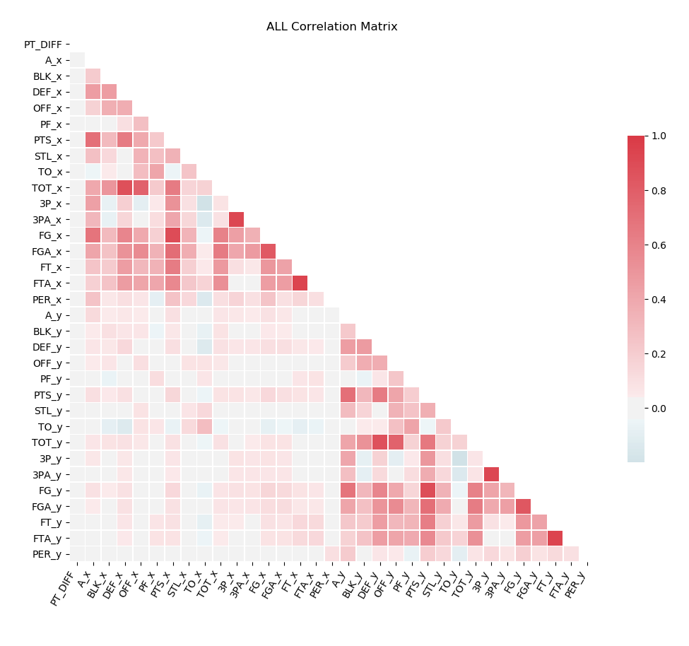
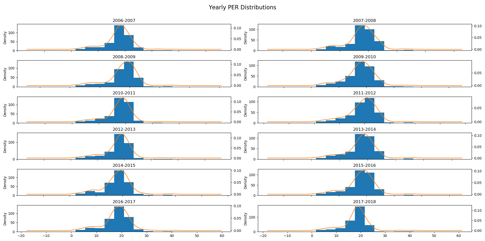

# College Basketball Predictions  
Using basic basketball counting stats combined with Player Efficiency Rating, can per game point differentials be predicted.  

Player Efficiency Rating (PER) is a per-minute rating developed by John Hollinger.  This statistic, "sums up all a player's positive accomplishments, subtracts the negative accomplishments, and returns a per-minute rating of a player's performance."  

### Questions
1. Has the mean Player Efficiency Rating (PER) per team (PER / number of players with a valid efficiency aka PER/p) increased from the 2006-2007 season to the 2016-2017 season?
2. Can seasonal averages for basketball counting stats (Assists, Points, Rebounds, etc.) and
PER/p predict per game point differential?

## EDA/Cleaning
A majority of the data used was contained within per games box scores.  Since compares and predictions are going to be made on seasonal averages, the data needed to be aggregated.  The data was split into three separate matrices to assist in the final aggregation.  The dataset used for modeling will combine yearly averages of two competing teams.

### Data
#### Player
PLAYER |	TEAM |	YEAR |	A 	|BLK |	DEF| 	OFF |PF |	PTS |	STL |	TO |	TOT |	3P |	3PA |	FG |	FGA |	FT |	FTA |	MINS |	GAMES |	PER|  
--------------|------------|--------|----|----|----|----|----|----|----|----|----|----|----|----|----|----|----|----|  
A.D. Vassallo|Virginia Tech 	|2006-2007| 	29.0| 	9.0| 	111.0| 	19.0| 	80.0| 	350.0| 	14.0| 	42.0| 	130.0| 	11.0| 	37.0| 	79.0| 	170.0| 	62.0| 	86.0| 	590.0| 	33 	|22.237219|  
A.J. Abrams 	|Texas 	|2006-2007| 	52.0| 	4.0| 	61.0| 	25.0| 	63.0| 	543.0| 	46.0| 	48.0| 	86.0| 	68.0| 	134.0| 	171.0| 	364.0| 	133.0| 	158.0| 	1202.0| 	35 	|2.933545|  
#### Team
TEAM 	|A |	BLK 	|DEF 	|OFF| 	PF 	|PTS| 	STL| 	TO| 	TOT| 	3P| 	3PA| 	FG| 	FGA| 	FT| 	FTA| 	PER/P|  
---|---|---|---|---|---|---|---|---|---|---|---|---|---|---|---|---|---|  
Air Force 	|13.484848| 	1.545455| 	18.000000 	|5.181818 	|12.575758| 	62.909091| 	6.181818| 	8.636364| 	23.181818| 	7.787879| 	18.848485| 	20.515152| 	42.272727| 	11.909091| 	15.666667| 	24.487105|  

#### Games
MATCH 	| DATE | 	PT_DIFF 	|HOME | 	AWAY|  
---|---|---|---|---|---|  
New Orleans vs. Vermont 	|2006-11-07 	|-17.0| 	New Orleans 	|Vermont|  


#### Feature Engineering
##### Generating PER
```
uPER = (1 / MP) *
     [ 3P
     + (2/3) * AST
     + (2 - factor * (team_AST / team_FG)) * FG
     + (FT *0.5 * (1 + (1 - (team_AST / team_FG)) + (2/3) * (team_AST / team_FG)))
     - VOP * TOV
     - VOP * DRB% * (FGA - FG)
     - VOP * 0.44 * (0.44 + (0.56 * DRB%)) * (FTA - FT)
     + VOP * (1 - DRB%) * (TRB - ORB)
     + VOP * DRB% * ORB
     + VOP * STL
     + VOP * DRB% * BLK
     - PF * ((lg_FT / lg_PF) - 0.44 * (lg_FTA / lg_PF) * VOP) ]

factor = (2 / 3) - (0.5 * (lg_AST / lg_FG)) / (2 * (lg_FG / lg_FT))
VOP    = lg_PTS / (lg_FGA - lg_ORB + lg_TOV + 0.44 * lg_FTA)
DRB%   = (lg_TRB - lg_ORB) / lg_TRB

pace adjustment = lg_Pace / team_Pace
Pace = 40 * (Poss / (0.2 * Tm_MP))
Poss = 0.5 * (FGA + 0.475 * FTA - ORB + TOV) + 0.5 * (Opp FGA + 0.475 * Opp FTA - Opp ORB + Opp TOV)

Pace Adjusted PER
aPER = (pace adjustment) * uPER

Final PER
PER = aPER * (15 / lg_aPER)
```
--Basketball Reference

Most statistics seen here are tracked by the official scorer for the game.  Additional statistics like Defensive Rebound Percentage (DRP%) and League Value of Possession (VOP) are calculated afterwards.


#### EDA

The correlation matrix above highlights some correlated features that are easily understood.  Free Throw makes (FT) is going to be highly correlated with Free Throw Attempts (FTA).  Similarly, Assists (A) will be highly correlated with Field Goals (FG).  The light box in the bottom left highlights the fact that most stats between competing teams are not correlated.  Although we see some correlated features, based on our knowledge of basketball statistics, we will not be removing any before we model.  

We are also going to be checking if PER has increased year over year so lets plot histograms of per with KDE to help determine if they are normally distributed.  


These distributions don't look quite normal so we will perform some tests to confirm.

### Hypothesis Testing
Since our PER data did not look normally distributed we cannot use an ANOVA to determine if one of the years has a

### Conclusion
The PER statistic is known to mainly use offensive statistics.  While it contains some defensive values, they do not fully measure a player's defensive capabilities.  Additionally, the data used, does not take into account play styles by different teams.  Since some teams may have a play style that focuses mainly on offense and not defense, they may score a lot of points and have an inflated PER/p, without winning many games.  Conversely, a team that focuses on defense, will have a lower PER/p, but they could win a lot of games. This inability to quantify defense in the data used could be introducing too much noise in the data to truly be able to predict well.
