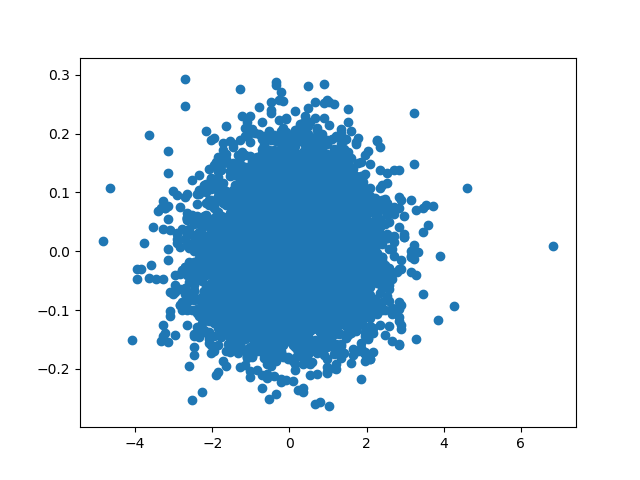

# College Basketball Predictions  
Using basic basketball counting stats combined with Player Efficiency Rating, can per game point differentials be predicted.  

Player Efficiency Rating (PER) is a per-minute rating developed by John Hollinger.  This statistic, "sums up all a player's positive accomplishments, subtracts the negative accomplishments, and returns a per-minute rating of a player's performance."  

### Questions
1. Has the mean Player Efficiency Rating (PER) per team (PER / number of players with a valid efficiency aka PER/p) increased from the 2006-2007 season to the 2016-2017 season?
2. Can seasonal averages for basketball counting stats (Assists, Points, Rebounds, etc.) and
PER/p predict per game point differential?

## EDA/Cleaning
A majority of the data used was contained within per games box scores.  Since compares and predictions are going to be made on seasonal averages, the data needed to be aggregated.  The data was split into three separate matrices to assist in the final aggregation.  The dataset used for modeling will combine yearly averages of two competing teams.

### Data
#### Player
| PLAYER | TEAM | YEAR | A | BLK | DEF | OFF | PF | PTS | STL | TO | TOT | 3P | 3PA | FG | FGA | FT | FTA | MINS | GAMES | PER |
| --- | --- | --- | --- | --- | --- | --- | --- | --- | --- | --- | --- | --- | --- | --- | --- | --- | --- | --- | --- | --- |
| A.D. Vassallo | Virginia Tech | 2006-2007 | 29.0 | 9.0 | 111.0 | 19.0 | 80.0 | 350.0 | 14.0 | 42.0 | 130.0 | 11.0 | 37.0 | 79.0 | 170.0 | 62.0 | 86.0 | 590.0 | 33 | 22.237219 |
| A.J. Abrams | Texas | 2006-2007 | 52.0 | 4.0 | 61.0 | 25.0 | 63.0 | 543.0 | 46.0 | 48.0 | 86.0 | 68.0 | 134.0 | 171.0 | 364.0 | 133.0 | 158.0 | 1202.0 | 35 | 2.933545 |


#### Team
| TEAM | A | BLK | DEF | OFF | PF | PTS | STL | TO | TOT | 3P | 3PA | FG | FGA | FT | FTA | PER/P |
| --- | --- | --- | --- | --- | --- | --- | --- | --- | --- | --- | --- | --- | --- | --- | --- | --- |
| Air Force 	|13.484848| 	1.545455| 	18.000000 	|5.181818 	|12.575758| 	62.909091| 	6.181818| 	8.636364| 	23.181818| 	7.787879| 	18.848485| 	20.515152| 	42.272727| 	11.909091| 	15.666667| 	24.487105|

#### Games
| MATCH | DATE | PT_DIFF | HOME | AWAY |
| --- | --- | --- | --- | --- |
| New Orleans vs. Vermont | 2006-11-07 | -17.0 | New Orleans | Vermont |  


#### Feature Engineering
##### Generating PER
```
uPER = (1 / MP) *
     [ 3P
     + (2/3) * AST
     + (2 - factor * (team_AST / team_FG)) * FG
     + (FT *0.5 * (1 + (1 - (team_AST / team_FG)) + (2/3) * (team_AST / team_FG)))
     - VOP * TOV
     - VOP * DRB% * (FGA - FG)
     - VOP * 0.44 * (0.44 + (0.56 * DRB%)) * (FTA - FT)
     + VOP * (1 - DRB%) * (TRB - ORB)
     + VOP * DRB% * ORB
     + VOP * STL
     + VOP * DRB% * BLK
     - PF * ((lg_FT / lg_PF) - 0.44 * (lg_FTA / lg_PF) * VOP) ]

factor = (2 / 3) - (0.5 * (lg_AST / lg_FG)) / (2 * (lg_FG / lg_FT))
VOP    = lg_PTS / (lg_FGA - lg_ORB + lg_TOV + 0.44 * lg_FTA)
DRB%   = (lg_TRB - lg_ORB) / lg_TRB

pace adjustment = lg_Pace / team_Pace
Pace = 40 * (Poss / (0.2 * Tm_MP))
Poss = 0.5 * (FGA + 0.475 * FTA - ORB + TOV) + 0.5 * (Opp FGA + 0.475 * Opp FTA - Opp ORB + Opp TOV)

Pace Adjusted PER
aPER = (pace adjustment) * uPER

Final PER
PER = aPER * (15 / lg_aPER)
```
--Basketball Reference

Most statistics seen here are tracked by the official scorer for the game.  Additional statistics like Defensive Rebound Percentage (DRP%) and League Value of Possession (VOP) are calculated afterwards.


#### EDA

The correlation matrix above highlights some correlated features that are easily understood.  Free Throw makes (FT) is going to be highly correlated with Free Throw Attempts (FTA).  Similarly, Assists (A) will be highly correlated with Field Goals (FG).  The light box in the bottom left highlights the fact that most stats between competing teams are not correlated.  Although we see some correlated features, based on our knowledge of basketball statistics, we will not be removing any before we model.  

We are also going to be checking if PER has increased year over year so lets plot histograms of per with KDE to help determine if they are normally distributed.  


These distributions don't look quite normal so we will perform some tests to confirm.

### Hypothesis Testing
Since our PER data did not look normally distributed lets peform a Kolmogorov–Smirnov test to compare our data with the normal distribution.  Our null hypothesis with a KS will be that our data is equally distributed with the normal distribution.  The alternative hypothesis will be that our distributions are not equal.  For all tests we will be performing we will use α = 0.05.

| YEARS | KS Statistic | p_value |
| --- | --- | --- |
| 2006-2007 | 0.993 | 0.0 |
| 2007-2008 | 0.993 | 0.0 |
| 2008-2009 | 0.993 | 0.0 |
| 2009-2010 | 0.991 | 0.0 |
| 2010-2011 | 0.991 | 0.0 |
| 2012-2013 | 0.991 | 0.0 |
| 2011-2012 | 0.991 | 0.0 |
| 2013-2014 | 0.992 | 0.0 |
| 2014-2015 | 0.991 | 0.0 |
| 2015-2016 | 0.990 | 0.0 |
| 2016-2017 | 0.992 | 0.0 |
| 2017-2018 | 0.991 | 0.0 |

Our p_value of 0 for each year confirms our previous assumption that the PER value is not normally distributed.  This fact will prevent us from using an ANOVA to determine if one year is statistically different from the rest.  There is a non-parametric test, Kruskal-Wallis H-test, that can be performed in place of the ANOVA.  It is easy to plug our data into this test in Scipy Stats (giving a result of **statistic = 45.8** and **p_value = 3.38e-06**) but I am not fully able to explain how this test works.  

If we assume the result from the Kruskal-Wallis test is valid, we can then find another non-parametric to use in place of a t-test to compare our years.  Since we are only interested in determining if there has been an increase between the 2006-2007 season and the 2016-2017 season we can use another easy plug and play test.  This time we will use the Mann-Whitney U test.  With this test, our null hypothesis will be that it is equally likely that a randomly selected value from the 2006-2007 sample will be less than or greater than a randomly selected value from the 2016-2017 sample.  

Running the test we get the result **statistic = 54985.0** and **p_value = 0.043**.  Since the p_value from this test is less than alpha of 0.05 we will reject our null hypothes is that it
equally likely a randomly selected mean PER from 2006-2007 will be less than a
randomly selected mean PER from 2016-2017.  Thus the mean PER from 2006-2007 tends to be
less than the mean PER from 2016-2017.  

This implies the mean PER has generally increased from 2006-2007
to 2016-2017.


### Modeling
Our goal is to attempt to predict the point differential between two teams based upon their seasonal averages and their PER/p.  First we will create a simple Linear Regression model with our data standardized.

  
```RMSE: 0.987```  
This doesn't look too good.  

Lets look at the coefficients:

| Feature | Coefficient |
| --- | --- |
| A_x |  0.0832 |
| BLK_x |  0.0479 |
| DEF_x |  -1734196929117.3 |
| OFF_x |  -1330538879087.6 |
| PF_x |  0.211 |
| PTS_x |  0.194 |
| STL_x |  -0.175 |
| TO_x |  0.103 |
| TOT_x |  2543607209574.8 |
| 3P_x |  -0.303 |
| 3PA_x |  0.214 |
| FG_x |  0.110 |
| FGA_x |  -0.0123 |
| FT_x |  0.176 |
| FTA_x |  -0.146 |
| PER_x |  0.183 |
| A_y |  0.00507 |
| BLK_y |  0.196 |
| DEF_y |  -89532052022130.2 |
| OFF_y |  -69576776600509.9 |
| PF_y |  -0.184 |
| PTS_y |  0.321 |
| STL_y |  0.557 |
| TO_y |  0.274 |
| TOT_y |  132265985065314.3 |
| 3P_y |  0.727 |
| 3PA_y |  -0.348 |
| FG_y |  -0.226 |
| FGA_y |  -0.0101 |
| FT_y |  -0.358 |
| FTA_y |  0.271 |
| PER_y |  -0.333 |

It looks like there are four coefficients TOT_x, TOT_y, DEF_x, DEF_y, OFF_x, and OFF_y which are dominating our model. These coefficients all relate to rebounding, but it is surprising that points is not much higher.  Thinking about it, a team will gain or lose possession on a rebound, but I wouldn't think it would be this high.

Let's make a model that will do all of the thinking for us to determine the right coefficients.  This model will be an ElasticNet with a cross validated Grid Search.  The Elastic Net model will combine both Ridge and Lasso regularization and the cross validated Grid Search will allow us to pass the ElasticNet varying alpha and L1 ratios.  The resulting best alpha and L1 ratios were, surprisingly **alpha = 0.1** and **l1_ratio = 0.0**.  With a zero L1 ratio, the model is saying that a purely Ridge based model is best.  This is implying all removing features does not produce a better model.  The alpha of 0.1 is implying that we do not have a very complex model.  

Lets look at the coefficients of a Ridge with our alpha.

| Feature | Coefficient |
| --- | --- |
| A_x | -0.00390 |
| BLK_x | 0.00529 |
| DEF_x | 0.00790 |
| OFF_x | -0.00813 |
| PF_x | 0.00344 |
| PTS_x | -0.0130 |
| STL_x | -0.000406 |
| TO_x | 0.00525 |
| TOT_x | 0.00112 |
| 3P_x | -0.0566 |
| 3PA_x | 0.0588 |
| FG_x | 0.0559 |
| FGA_x | -0.0376 |
| FT_x | 0.0451 |
| FTA_x | -0.0282 |
| PER_x | 0.0121 |
| A_y | -0.0307 |
| BLK_y | 0.00181 |
| DEF_y | -0.0152 |
| OFF_y | 0.00458 |
| PF_y | -0.0121 |
| PTS_y | 0.0585 |
| STL_y | 0.0246 |
| TO_y | 0.0303 |
| TOT_y | -0.00786 |
| 3P_y | 0.0636 |
| 3PA_y | -0.0411 |
| FG_y | -0.00404 |
| FGA_y | -0.0111 |
| FT_y | -0.0307 |
| FTA_y | -0.00144 |
| PER_y | -0.0233 |

These look much better from an outlier standpoint, but it is now concerning that they are all close to zero.  Lets plot predicted vs test again.  
  

Not much better, infact our RMSE is worse.  
```RMSE: 1.511 ```

With the worse RMSE, this supports our analysis of the low alpha implying we do not have a very complex model.

### Conclusion
The PER statistic is known to mainly use offensive statistics.  While it contains some defensive values, they do not fully measure a player's defensive capabilities.  Additionally, the data used, does not take into account play styles by different teams.  Since some teams may have a play style that focuses mainly on offense and not defense, they may score a lot of points and have an inflated PER/p, without winning many games.  Conversely, a team that focuses on defense, will have a lower PER/p, but they could win a lot of games. This inability to quantify defense in the data used could be introducing too much noise in the data to truly be able to predict well.
